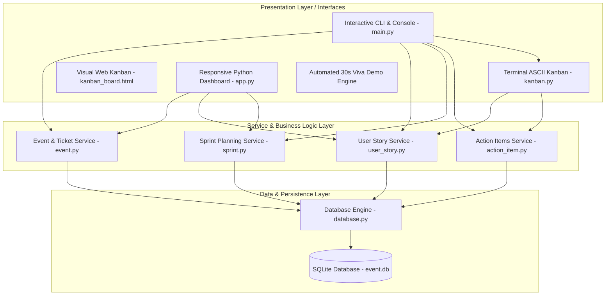
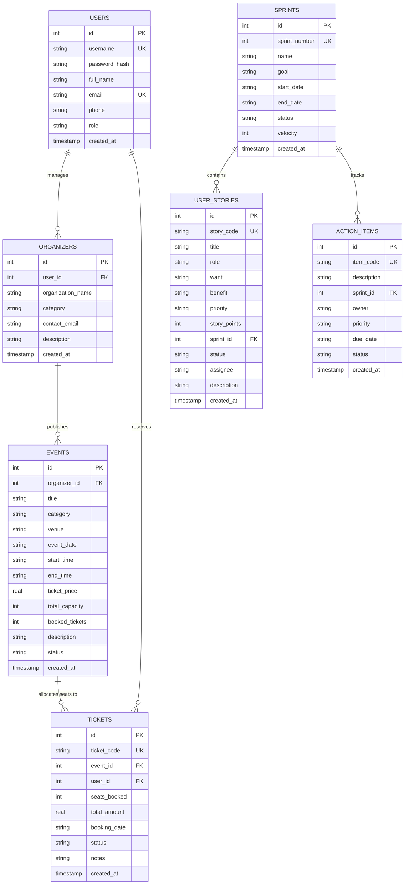
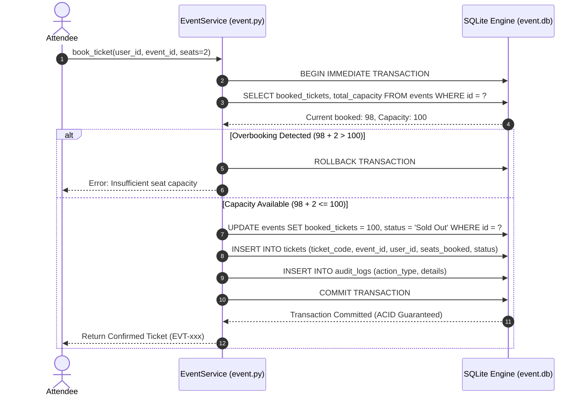

# System Design & Architecture
## Event Management System using Scrum Agile Methodology

---

## 1. System Architecture

The project is architected following a modular **3-Tier Layered Architecture**, strictly separating presentation, business logic, and relational data persistence.

---

## 2. Database Design & Entity-Relationship Diagram (ERD)

The system utilizes an embedded relational database (SQLite 3) with strict foreign key constraints enabled via `PRAGMA foreign_keys = ON;`.

---

## 3. Concurrency Control & Atomic Booking Pipeline

To eliminate overbooking race conditions during high concurrent traffic, the system implements an explicit **Atomic Transaction Pipeline**:

---

## 4. Key Design Patterns Applied

1. **Service Layer Pattern:** Encapsulates business logic away from presentation components, making both CLI and Web interfaces share identical validated service routines.
2. **Defensive Concurrency Locking:** SQLite `BEGIN IMMEDIATE` combined with capacity checks protects against double-allocation anomalies.
3. **Cryptographic Salted Hashing:** Passwords protected via `SHA-256(salt + password)`, guarding against rainbow table precomputation attacks.
4. **State Machine Transitions:** User stories and tickets follow strictly validated lifecycle states (`Backlog -> To Do -> In Progress -> Review -> Done`).
